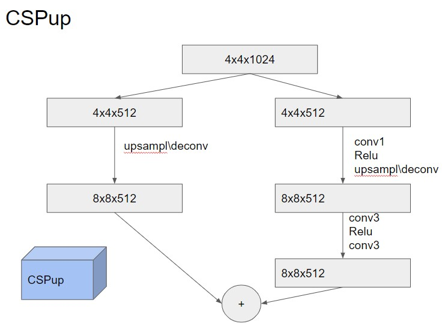
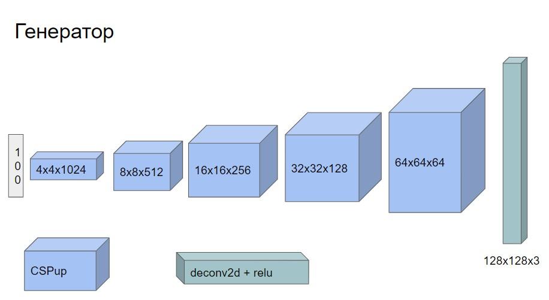

# ДЗ 1. Имплементация GAN

1. Скачать датасет [CelebA](https://mmlab.ie.cuhk.edu.hk/projects/CelebA.html) (можно через [pytorch](https://pytorch.org/vision/stable/generated/torchvision.datasets.CelebA.html))
2. Имплементировать CSPup блок (5 баллов)

3. Имплементировать генератор GAN по заданной архитектурной схеме (10 баллов)

4. Обучить имплементированный GAN (5 баллов)
5. Добиться сходимости (регуляризации, изменение архитектуры, фишки с train loop) (10 баллов)

## Кириллов, доп. задание:

Реализация mapper.

1. Создать класс PixelNorm для нормализации вектора z
- наследуется от torch.nn.Module
- при инициализаци фиксирует eps=1e-8 
- нормализует сигнал ветокра x / sqrt(mean(x^2) + eps)
2.  Создать класс MappingNet
- наследуется от torch.nn.Module
- два обязательных метода: init и forward
- входные параметры: 
z_dim — размер входного шума
w_dim — размер выходного вектора
num_layers — глубина сети
3. Собрать MLP внутри класса
- с помощью torch.nn.Sequential собрать последовательность слоев (num_layers штук)
- каждый слой это одинаковый Linear + LeakyRelU(0.2)
- конечный выходной слой должен иметь размерность w_dim (обычно z_dim=w_dim)
4. Реализовать forward
z -> PixelNorm -> MLP -> w
5. Добавить mapper в train loop
- маппер между z и G
- добавить mapper в оптимизатор
6. Сравнить результаты с экспериментами без маппера

## Бондаренко, доп. задание:

Сравнительный анализ типов нормализации в Генераторе.

Провести сравнительный анализ типов нормализации в Генераторе. Необходимо дополнительно обучить 3 версии модели:
- С Batch Normalization (baseline для DCGAN)
- С Instance Normalization
- С Layer Normalization (или No Norm ,тоже зачтётся)
Результаты анализа можно предоставить в виде таблицы:
| Аспект | Batch Norm | Instance Norm | Group Norm |
| :--- | :--- | :--- | :--- |
| Стабильность лосса (график обучения) | | | |
| Время до сходимости (№ эпохи) | | | |
| Наблюдаемые проблемы (mode collapse, артефакты, шум) | | | |
| Доп. заметки (особенности обучения) | | | |
Дополнительно: Параметры обучения в рамках эксперимента не должны изменяться

## Боярская,  доп. задание:

Реализация Wasserstein GAN (WGAN)

Цель: Модифицировать текущую реализацию GAN, внедрив метрику Вассерштейна для стабилизации обучения.

Инструкция по реализации:

1.  Архитектура Дискриминатора:
    Удалите функцию активации с последнего слоя Дискриминатора. Сеть должна выдавать неограниченные вещественные значения (logits), а не вероятности.

2.  Функция потерь (Loss Function):
    Замените BCELoss на функцию потерь Вассерштейна. Вместо классификации «real/fake», Дискриминатор обучается максимизировать разность между средними оценками для реальных и сгенерированных данных.
    Функция:
    
Loss=E[D(x_{fake})]−E[D(x_{real})]
    Реализация: Реализуйте побатчевый подсчет лоссов.

3.  Ограничение весов (Weight Clipping):
    Для выполнения условия Липшицевости необходимо ограничить веса Дискриминатора. После каждого шага оптимизации Дискриминатора применяйте операцию *clipping* ко всем его весам, ограничивая их числовым диапазоном [-c, c].

В отчете также отразить, как изменилось качество обучения при изменении лосса. Привести графики ошибки и изображения, полученные в результате генерации

## Бойматов, доп. задание:

Дополнительное задание на 5 баллов
Повышение стабильности обучения GAN

В рамках решения задачи можно взять только 2 любых из 3 улучшений. (например EMA + MiniBatchStdDev).
Модифицировать архитектуру и train loop GAN, добавив несколько техник стабилизации обучения:
1) реализовать слой MinibatchStdDev и встроить его в дискриминатор
2) добавить spectral normalization к сверточным и линейным слоям дискриминатора
3) реализовать Exponential Moving Average (EMA) для генератора

Требования к реализации

1. MinibatchStdDev
Создать класс MinibatchStdDev
наследуется от torch.nn.Module
на вход получает тензор признаков размера [B, C, H, W]
вычисляет статистику разброса по объектам батча
усредняет ее до одного скаляра
повторяет этот скаляр по spatial-размерам
добавляет его к входным признакам как дополнительный канал

Как должно выглядеть решение:
написан отдельный класс MinibatchStdDev
в методе forward:
1) по батчу считается std
2) std усредняется до одного числа
3) число приводится к тензору размера [B, 1, H, W]
4) конкатенируется с исходным тензором по channel dimension

2. Spectral Normalization
Модифицировать дискриминатор
для сверточных и линейных слоев дискриминатора применить spectral normalization
использовать torch.nn.utils.spectral_norm

Как должно выглядеть решение:
в архитектуре дискриминатора обычные слои Conv2d / Linear оборачиваются через spectral_norm(...)
например:
spectral_norm(nn.Conv2d(...))
spectral_norm(nn.Linear(...))

3. EMA для генератора
Создать EMA-копию генератора
после каждого шага обновления генератора обновлять EMA-веса по правилу экспоненциального скользящего среднего
использовать EMA-генератор для генерации примеров при оценке качества

Как должно выглядеть решение:
после создания генератора создается его копия generator_ema
параметры generator_ema не обучаются через optimizer
после каждого шага генератора выполняется обновление:
ema_param = decay * ema_param + (1 - decay) * param
для сохранения изображений и итоговой оценки используются сэмплы из generator_ema

Провести эксперимент
обучить две версии модели:
1) baseline без указанных модификаций
2) модель с MinibatchStdDev + spectral normalization + EMA (можно взять  2 любых из 3 улучшений)

Сравнить результаты
сравнить стабильность обучения
сравнить визуальное качество генерации
кратко описать, стало ли обучение устойчивее и улучшилось ли качество сэмплов и оформить резултаты проделанной работы в отчет.
